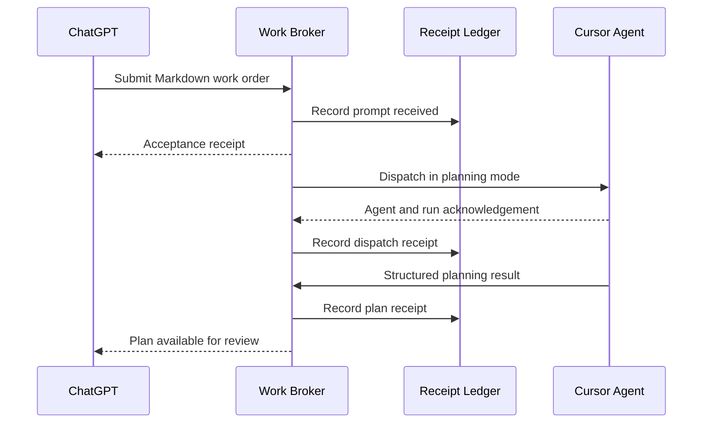

# Agent Work Relay (AWR)

> **Pass work between agents—not through humans.**

Agent Work Relay is a durable agnostic work broker that routes requests,
applies guardrails, records receipts and returns results between AI agents.

The initial engineering profile provides typed, auditable work-order handoffs
between planning agents and coding agents.

## The problem: Humans are the message couriers

*Copying and pasting prompts, clicking download buttons for artifacts and
Markdown files, and transferring files from local download folders into
development projects. Madness!*

You shape a feature in ChatGPT or Claude. Then the relay race begins: copy the
prompt, switch tabs, paste it into Cursor, download the spec, hunt it down in
Downloads, move it into the project, copy the response back, and do it all
again.

**Brilliant AI tools, connected by your clipboard. Not exactly the autonomous
future we were promised.**

Every trip creates another chance to lose context, grab the wrong file,
duplicate work, or forget what was sent. AWR handles the handoff and keeps the
receipts. You make the decisions; the broker does the courier work.

AWR removes the human from the transport loop while preserving human review and
approval. The target prompt-to-plan handoff is intentionally small and
explicit:



The scaffold implements this complete sequence with its recording Cursor
adapter. Set `AWR_EXECUTOR=cursor_cloud` and provide a Cursor API key to run the
same contracts against a real repository.

## How the relay works

AWR gives AI agents a direct, dependable way to hand work to one another.
ChatGPT or Claude can send a feature request or refinement to the right coding
agent without asking a human to download a file, switch tools, or copy and
paste the response back. AWR keeps track of what was sent, where it went, and
what came back—so people can focus on reviewing decisions and approving work
instead of acting as the courier.

The planner remains responsible for defining and reviewing the work. The coding
agent remains responsible for repository-aware planning and implementation. AWR
provides the reliable, inspectable path between them.

## Prototype boundary

The first vertical slice is `AWR-GT-001`: ChatGPT prompt to reviewable Cursor
plan.

1. A planning agent creates Markdown beginning with `@awr feature.plan` or
   `@awr refinement.plan parent=<work-order-id>`.
2. The `submit_prompt_for_planning` MCP tool sends it to AWR.
3. AWR binds the repository and base reference, stores the immutable payload
   hash, and returns an acceptance receipt.
4. AWR applies a versioned `PLAN_ONLY` wrapper and creates a Cursor run in
   native Plan mode with branch mutation and automatic PR creation disabled.
5. The adapter returns durable agent and run IDs; AWR records the receipt.
6. `refresh_planning` reads the run until Cursor returns its final plan.
7. AWR fingerprints the plan, records `plan.received` and `plan.available`, and
   returns the `PlanPacket` to the originating planner.
8. Replaying the same idempotency key or refreshing a finished run does not
   duplicate the agent, plan, or ledger receipts.

The included `RecordingCursorExecutor` makes the full flow executable without
external credentials. The real Cursor Cloud Agents API v1 adapter uses the same
domain and ledger contracts.

## Quick start

The core and its tests use only the Python 3.12 standard library.

```bash
cd agent-work-relay
PYTHONPATH=src python -m unittest discover -s tests -v
PYTHONPATH=src python -m awr demo --db .awr/demo.db
PYTHONPATH=src python -m awr ledger --db .awr/demo.db
```

Install the MCP transport when you are ready to connect an MCP host:

```bash
uv sync --extra mcp --extra dev
uv run awr mcp
```

### Run against Cursor Cloud

Create a Cursor API key, make sure Cursor can access the target GitHub
repository, and export the runtime configuration. Keep the key in your shell or
secret manager—never commit it.

```bash
export AWR_EXECUTOR=cursor_cloud
export AWR_STORAGE=sqlite
export AWR_SQLITE_PATH=.awr/awr.db
export AWR_REPOSITORY_URL=https://github.com/your-org/your-repo
export AWR_BASE_REF=main
export CURSOR_API_KEY=your-key

uv sync --extra mcp --extra cursor --extra dev
uv run awr mcp
```

See [docs/LIVE_PROTOTYPE.md](docs/LIVE_PROTOTYPE.md) for the golden-test
runbook and the boundary between the local and hosted profiles.

Cursor engineers should use
[docs/CURSOR_PRODUCT_SUMMARY_AND_CLOUD_RUN_BUILD.md](docs/CURSOR_PRODUCT_SUMMARY_AND_CLOUD_RUN_BUILD.md)
for the product context, hosted architecture, GCP target, acceptance criteria,
and copy-ready next-build prompt.

## MCP tool

The MCP server exposes four tools:

- `submit_prompt_for_planning` validates, fingerprints, stores, and dispatches
  the work order;
- `refresh_planning` reads Cursor run state and captures a terminal plan;
- `get_plan` returns the immutable, fingerprinted `PlanPacket`;
- `get_work_order_timeline` returns the complete ordered receipt ledger.

`submit_prompt_for_planning` accepts:

- `markdown`: the complete decorated Markdown prompt/spec;
- `sender`: a stable planner identity such as `chatgpt:product-planner`;
- `recipient`: a configured executor identity such as `cursor:backend`;
- `repository_url`: an HTTPS GitHub repository URL, unless configured as the
  broker default;
- `base_ref`: the starting branch or commit, defaulting to `main`;
- `idempotency_key`: optional caller-supplied replay key.

It returns an acceptance receipt containing the work-order ID, content hash,
status, duplicate flag, and current ledger sequence.

## Repository map

```text
src/awr/
  contracts.py          typed work orders, receipts, and ledger entries
  decorators.py         strict @awr command grammar
  service.py            deterministic orchestration
  wrappers.py           versioned executor envelopes
  executors/            provider-neutral executor port and Cursor seam
  storage/              storage port, SQLite default, cloud placeholders
  transports/           MCP v2 and optional HTTP surfaces
tests/
  test_decorators.py
  test_golden_prompt_to_plan.py
docs/
  ARCHITECTURE.md
  CURSOR_PRODUCT_SUMMARY_AND_CLOUD_RUN_BUILD.md
  AWR-GT-001.md
  LIVE_PROTOTYPE.md
```

## Storage model

SQLite is the local authoritative default. `StateStore` is the portability
boundary for Firestore and Supabase/Postgres adapters. IndexedDB may later cache
browser drafts, but it is not an authoritative multi-agent ledger.

## Safety posture

- The decorator selects a known intent; it never grants authority.
- `*.plan` wrappers explicitly forbid file changes, commits, and pull requests.
- Every payload and wrapper is fingerprinted.
- Ledger rows are append-only by application contract.
- Executor side effects are protected by idempotency keys.
- Unknown directives fail closed.

See [docs/ARCHITECTURE.md](docs/ARCHITECTURE.md) and
[docs/AWR-GT-001.md](docs/AWR-GT-001.md).
