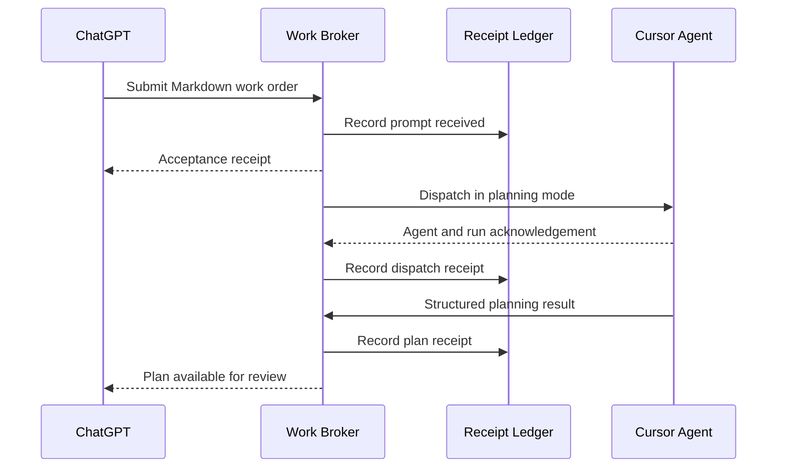

# Engineering Work Broker (EWB)

Typed, auditable work-order handoffs between planning agents and coding agents.

## The problem: Humans are the message couriers

*Copying and pasting prompts, clicking download buttons for artifacts and
Markdown files, and transferring files from local download folders into
development projects. Madness!*

You shape a feature in ChatGPT or Claude. Then the relay race begins: copy the
prompt, switch tabs, paste it into Cursor, download the spec, hunt it down in
Downloads, move it into the project, copy the response back, and do it all
again.

**Brilliant AI tools, connected by your clipboard. Not exactly the autonomous
future we were promised.**

Every trip creates another chance to lose context, grab the wrong file,
duplicate work, or forget what was sent. EWB handles the handoff and keeps the
receipts. You make the decisions; the broker does the courier work.

EWB removes the human from the transport loop while preserving human review and
approval. The target prompt-to-plan handoff is intentionally small and
explicit:



The current scaffold implements the sequence through agent/run acknowledgement.
Structured plan capture and return to the originating planner is the next
milestone.

## What EWB changes

EWB replaces the manual Markdown shuttle with a deterministic control plane.
Planning clients submit a decorated Markdown work order through MCP. The broker
validates it, applies a versioned wrapper, records every handoff in an
append-only ledger, routes it through the appropriate executor adapter, and
returns durable receipts and results to the originating planner.

The planner remains responsible for defining and reviewing the work. The coding
agent remains responsible for repository-aware planning and implementation. EWB
provides the reliable, inspectable path between them.

## Prototype boundary

The first vertical slice is `EWB-GT-001`: prompt to Cursor planning receipt.

1. A planning agent creates Markdown beginning with `@ewb feature.plan` or
   `@ewb refinement.plan parent=<work-order-id>`.
2. The `submit_prompt_for_planning` MCP tool sends it to EWB.
3. EWB stores the immutable payload hash and an acceptance receipt in SQLite.
4. EWB applies a versioned `PLAN_ONLY` wrapper and routes the packet to a
   Cursor executor adapter.
5. The adapter acknowledges the run; EWB records that receipt in the ledger.
6. Replaying the same idempotency key returns the original work order without
   launching the executor twice.

The included `RecordingCursorExecutor` makes this flow executable without
external credentials. The real Cursor Cloud adapter is the next integration.

## Quick start

The core and its tests use only the Python 3.12 standard library.

```bash
cd engineering-work-broker
PYTHONPATH=src python -m unittest discover -s tests -v
PYTHONPATH=src python -m ewb demo --db .ewb/demo.db
PYTHONPATH=src python -m ewb ledger --db .ewb/demo.db
```

Install the MCP transport when you are ready to connect an MCP host:

```bash
uv sync --extra mcp --extra dev
uv run ewb mcp
```

## MCP tool

`submit_prompt_for_planning` accepts:

- `markdown`: the complete decorated Markdown prompt/spec;
- `sender`: a stable planner identity such as `chatgpt:product-planner`;
- `recipient`: a configured executor identity such as `cursor:backend`;
- `idempotency_key`: optional caller-supplied replay key.

It returns an acceptance receipt containing the work-order ID, content hash,
status, duplicate flag, and current ledger sequence.

## Repository map

```text
src/ewb/
  contracts.py          typed work orders, receipts, and ledger entries
  decorators.py         strict @ewb command grammar
  service.py            deterministic orchestration
  wrappers.py           versioned executor envelopes
  executors/            provider-neutral executor port and Cursor seam
  storage/              storage port, SQLite default, cloud placeholders
  transports/           MCP v2 and optional HTTP surfaces
tests/
  test_decorators.py
  test_golden_prompt_to_plan.py
docs/
  ARCHITECTURE.md
  EWB-GT-001.md
```

## Storage model

SQLite is the local authoritative default. `StateStore` is the portability
boundary for Firestore and Supabase/Postgres adapters. IndexedDB may later cache
browser drafts, but it is not an authoritative multi-agent ledger.

## Safety posture

- The decorator selects a known intent; it never grants authority.
- `*.plan` wrappers explicitly forbid file changes, commits, and pull requests.
- Every payload and wrapper is fingerprinted.
- Ledger rows are append-only by application contract.
- Executor side effects are protected by idempotency keys.
- Unknown directives fail closed.

See [docs/ARCHITECTURE.md](docs/ARCHITECTURE.md) and
[docs/EWB-GT-001.md](docs/EWB-GT-001.md).
