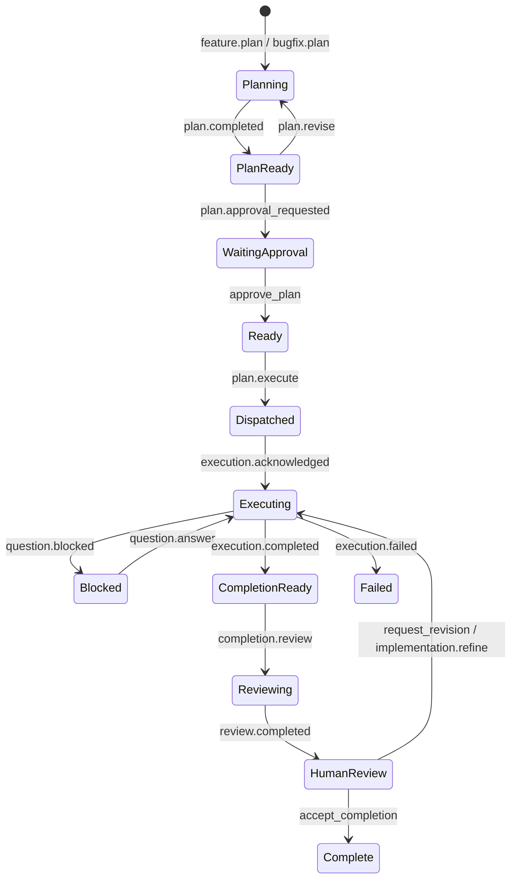

# Agent Work Relay skills bundle

The AWR skill is a shared, provider-neutral operating layer for planning
agents, coding agents, review agents, broker adapters, and human decision
makers. Its core message grammar is intentionally small:

```text
@input     work moving toward the next agent
@response  receipts, questions, results, and evidence moving back
```

Lifecycle intent belongs in the typed AWR envelope rather than in extra
top-level decorators. Neither decorator grants authority.

## Canonical location

```text
.agents/skills/agent-work-relay/
```

Do not create divergent planner, Cursor, Claude Code, Gemini, or reviewer
copies. Client shims must point at this directory.

The skill contains:

- a concise `SKILL.md` that selects a role and loads one reference path;
- role references for planner, worker, reviewer, adapter, and human;
- shared references for lifecycle, decorators, MCP tools, capability,
  idempotency, installation, and customization;
- eight generalized `@input` templates;
- eight generalized `@response` templates;
- `assets/template-manifest.json` with exact SHA-256 fingerprints;
- deterministic validation and fingerprint scripts;
- OpenAI skill metadata declaring the AWR MCP dependency.

Installation and MCP connection are separate. Credentials never live in the
skill. See [`.agents/skills/agent-work-relay/references/installation.md`](../.agents/skills/agent-work-relay/references/installation.md).

## Role routing

| Role | Reference |
|---|---|
| Planning agent | `references/planner-workflows.md` |
| Coding or execution agent | `references/worker-workflows.md` |
| Review agent | `references/reviewer-workflows.md` |
| Broker or trusted adapter | `references/adapter-workflows.md` |
| Human decision-maker | `references/human-decisions.md` |

## Common lifecycle



`review.completed` is a recommendation with outcome `APPROVED`, `REVISE`,
or `REJECTED`. Only `REVISE` moves the work order to `REVISION_REQUIRED`.
Only a stored human or policy `accept_completion` decision closes the
work order.

## Capability matrix

| Capability | Status on `762cbe4` | Notes |
|---|---|---|
| Markdown planning intake | Operational | `submit_prompt_for_planning` |
| Secure work bundles / artifact metadata | Operational | intake, finalize, status, references |
| `submit_response` | Operational | AS-03 `awr.response/v1` |
| `record_decision` | Operational | human or authorized policy only |
| Work-order and timeline reads | Operational | `get_work_order`, `get_work_order_timeline`, `list_pending_actions` |
| Planning refresh / `get_plan` | Operational | not execution refresh |
| `@input` `feature.plan` / `refinement.plan` | Operational | `submit_prompt_for_planning` |
| `@input` `bugfix.plan`, `plan.revise`, `question.answer`, `completion.review` | Prepared | missing `submit_input` |
| `@input` `plan.execute`, `implementation.refine` | Prepared | missing `submit_input` and AWR-EX-01 |
| LC-01B execution and review transitions | Operational | through submitted packets and stored decisions |
| Real Cursor execution dispatch | Prepared (EX-01) | stop if the user asked to execute and tools are missing |
| `refresh_external_run` | Prepared (EX-01) | do not invent the tool |
| Durable execution reconciliation | Prepared (EX-01) | adapter-owned once listed |
| Automatic ack / terminal capture | Prepared (EX-01) | not on this baseline |
| CLEAN artifact byte delivery | Unavailable (AS-04) | executors receive `not_delivered` |
| GCS / signed artifact access | Unavailable (AS-04) | never claim it |

Inspect the connected server's tool list before every mutation. Never claim
a relay, execution, artifact delivery, or decision succeeded without a
broker receipt.

## Direct MCP versus adapter-return

Transport is capability-detected. Use direct MCP only when the current
environment exposes outbound AWR tools (`get_work_order`,
`submit_response`). Then retrieve the work order and submit `@response`
packets through `submit_response`.

Otherwise use adapter-return: the worker returns one compact `@response`
in the provider result, and the trusted adapter validates and submits it.
Do not assume Cursor Cloud can call MCP, and do not require it to.

## Compact responses

Large logs, complete diffs, reports, and screenshots belong in immutable
artifact references. Response templates stay compact and always set
`authority: report_only`.

## Validation

```bash
uv run python .agents/skills/agent-work-relay/scripts/refresh_template_manifest.py
uv run python .agents/skills/agent-work-relay/quick_validate.py
uv run python .agents/skills/agent-work-relay/scripts/validate_skill_bundle.py
uv run python .agents/skills/agent-work-relay/scripts/validate_gt003.py
```

Static GT-003 fixtures for Agent 1 live in
[`examples/AWR-GT-003/`](../examples/AWR-GT-003/).
