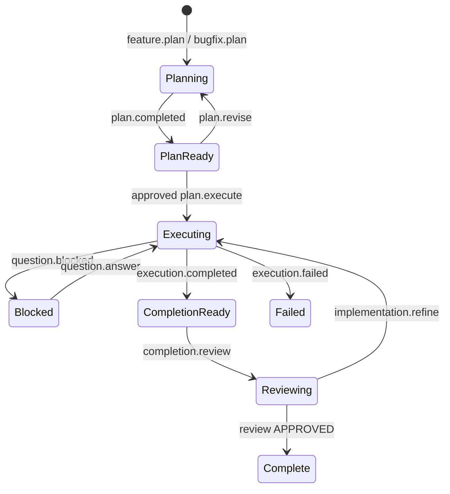

# Agent Work Relay skills bundle

The AWR skill is a shared, provider-neutral operating layer for planning agents,
coding agents, and review agents. Its core message grammar is intentionally
small:

```text
@input     work moving toward the next agent
@response  receipts, questions, results, and evidence moving back
```

Lifecycle intent belongs in the typed AWR envelope rather than in an expanding
set of top-level decorators.

## What is included

The installable skill lives at:

```text
.agents/skills/agent-work-relay/
```

It contains:

- a role-neutral `SKILL.md` used by planners, workers, and reviewers;
- progressive references for decorators, lifecycle, MCP tools, safety,
  installation, and customization;
- eight generalized `@input` templates;
- eight generalized `@response` templates;
- a machine-readable template manifest;
- OpenAI skill metadata declaring the AWR MCP dependency.

## Common lifecycle



Approvals and other authority decisions are restricted MCP actions. A decorator
describes message direction and intent; it never grants authority.

## Current versus target MCP surface

The current hosted prototype supports the plan-only slice with four tools and
legacy `@awr feature.plan` / `@awr refinement.plan` decorators. The bundle
defines the target bidirectional protocol and the minimal additional tools:

- `submit_input`
- `submit_response`
- `get_work_order`
- `get_work_order_timeline`
- `list_pending_actions`
- `record_decision`
- `refresh_external_run`

Until those tools and lifecycle transitions are implemented, the skill must not
represent response, approval, or execution relay as operationally available.

## Distribution model

The same canonical skill should be available to every participant. Cursor Cloud
can discover the project-level `.agents/skills` copy directly. Other clients
should install or reference this same directory through their native skill or
instruction system and connect separately to the authenticated AWR MCP server.
No tokens or client-specific credentials belong in the bundle.

## Customization

Teams may copy and modify the templates. Preserve the decorator, schema,
lineage, authority binding, idempotency, and fingerprint fields. Give customized
templates a new ID or version, and have AWR record the selected template and
wrapper fingerprints in its receipt ledger.
