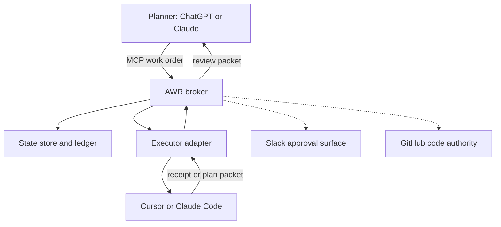
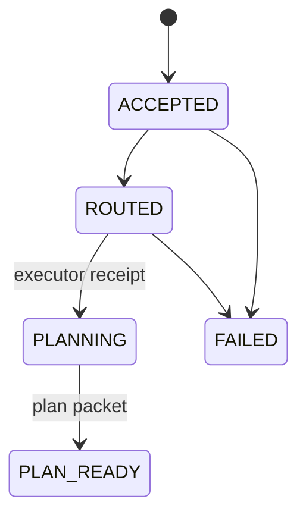

# Architecture

AWR is a deterministic work broker with MCP at its planner-facing edge. The
product relays work between agents; the broker core owns the state, guardrails,
receipts, and routing. MCP is an interface, not the state machine or durable
queue.

## Boundaries

| Boundary | Prototype | Later adapters |
|---|---|---|
| Planner protocol | MCP v2 | REST/webhook, CLI |
| State and ledger | SQLite | Firestore, Supabase/Postgres |
| Executor | Recording Cursor adapter | Cursor Cloud, Claude Agent SDK |
| Artifact body | Local quarantine/clean dirs | GCS object storage |
| Artifact metadata | SQLite `artifacts` tables | Firestore (later) |
| Notification | Ledger query | Slack app/webhooks |

## Domain rules

The domain service owns validation, idempotency, wrapper selection, state
transitions, and ledger emission. Transport, storage, and executor code may not
duplicate those decisions.

The ledger is an ordered event stream. A `work_orders` row is a materialized
snapshot for efficient reads; ledger entries are the audit record.

Supporting artifacts are pre-work-order objects. Their metadata lives in SQLite
`artifacts` rows. Binary bodies are stored outside SQLite under
`AWR_ARTIFACT_ROOT` in separate `quarantine/` and `clean/` trees. Artifact
receipts use `artifact_receipts`, not the work-order `ledger`, because artifacts
exist before a work-order ID. `work_order_id` on artifact receipts stays NULL
until a later bundle slice correlates them. Bodies are never written to
Firestore, SQLite BLOBs, or ledger JSON.

`ArtifactSecurityService.inspect` is the only path that may move an artifact
from `QUARANTINED` to `SCANNING` or `CLEAN`. Intake (`ArtifactService`) writes
quarantine only, through a facade that refuses `promote_clean`. Inspection
claims a short scan lease, runs detection, malware scanning, and format
validation outside the SQLite write lock, persists an `ArtifactSecurityReceipt`
for that SHA-256, promotes the exact generation when the verdict is clean, then
CAS-completes the status. Live leases serialize concurrent workers. Expired
leases are reclaimable. Timeouts, missing engines, malformed scanner responses,
and missing optional validators fail closed as `REJECTED_SCANNER_UNAVAILABLE`.

Allowlisted families are UTF-8 text/markdown, JSON, YAML (PyYAML SafeLoader),
PNG/JPEG (Pillow), and unencrypted PDFs without JavaScript, launch actions, or
embedded files (pypdf). ZIP, OLE, ELF/PE, SVG, and unknown binaries are type
rejected. `@awr` text inside an artifact never grants control authority;
diagnostics record `control_authority=primary_markdown_only`.

PDF residual risk: keyword scans and pypdf structural checks can miss
obfuscated active content. The gate still fails closed on encryption, known
active-content markers, and parse errors. ClamAV is the reference malware
adapter and is invoked with an argument list, never a shell string.

Pillow, PyYAML, and pypdf are an optional `security` extra. Production enforce
mode without those libraries rejects the corresponding types as scanner
unavailable. JSON and text validation use the standard library.

Retention deletes bodies only: unclaimed `DECLARED`/`QUARANTINED` after
`AWR_ARTIFACT_DECLARE_TTL` (24h), rejected bodies after the same TTL, and
`CLEAN` bodies after `AWR_ARTIFACT_CLEAN_TTL` (7d). Receipts are retained.

## Initial states

The recording adapter exercises the complete state path in `AWR-GT-001`. The
Cursor Cloud adapter uses the same transitions and receipts.

## Provider portability

`StateStore` is intentionally narrower than any vendor SDK. Firestore and
Supabase implementations must satisfy the same conformance tests as SQLite.
Provider-specific retry and transaction behavior belongs inside the adapter.
