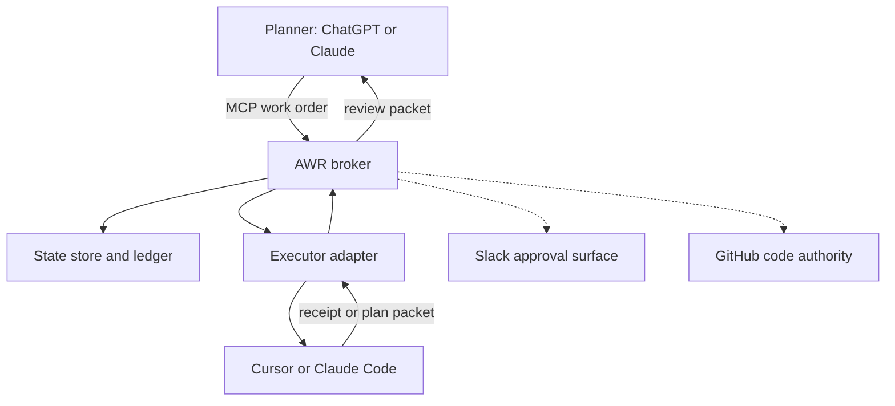
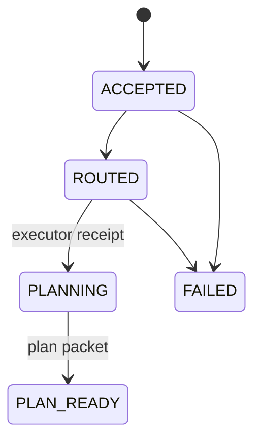

# Architecture

AWR is a deterministic work broker with MCP at its planner-facing edge. The
product relays work between agents; the broker core owns the state, guardrails,
receipts, and routing. MCP is an interface, not the state machine or durable
queue.

## Boundaries

| Boundary | Prototype | Later adapters |
|---|---|---|
| Planner protocol | MCP v2 | REST/webhook, CLI |
| State and ledger | SQLite | Firestore, Supabase/Postgres |
| Executor | Recording Cursor adapter | Cursor Cloud, Claude Agent SDK |
| Artifact body | Local quarantine/clean dirs | GCS object storage |
| Artifact metadata | SQLite `artifacts` tables | Firestore (later) |
| Notification | Ledger query | Slack app/webhooks |

## Domain rules

The domain service owns validation, idempotency, wrapper selection, state
transitions, and ledger emission. Transport, storage, and executor code may not
duplicate those decisions.

The ledger is an ordered event stream. A `work_orders` row is a materialized
snapshot for efficient reads; ledger entries are the audit record.

Supporting artifacts are pre-work-order objects. Their metadata lives in SQLite
`artifacts` rows. Binary bodies are stored outside SQLite under
`AWR_ARTIFACT_ROOT` in separate `quarantine/` and `clean/` trees. Artifact
receipts use `artifact_receipts`, not the work-order `ledger`, because artifacts
exist before a work-order ID. `work_order_id` on artifact receipts stays NULL
until a later bundle slice correlates them. Bodies are never written to
Firestore, SQLite BLOBs, or ledger JSON.

## Initial states

The recording adapter exercises the complete state path in `AWR-GT-001`. The
Cursor Cloud adapter uses the same transitions and receipts.

## Provider portability

`StateStore` is intentionally narrower than any vendor SDK. Firestore and
Supabase implementations must satisfy the same conformance tests as SQLite.
Provider-specific retry and transaction behavior belongs inside the adapter.
