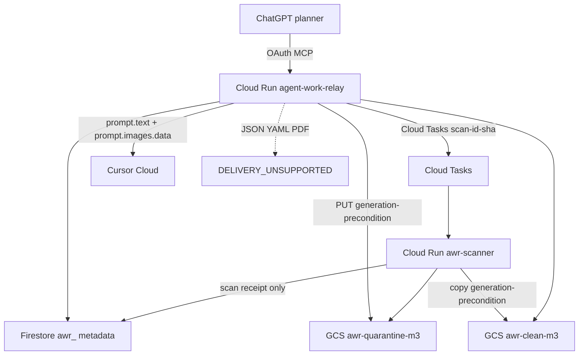

# AWR-AS-04 planning packet

This packet replaces the original single-slice AS-04 prompt. The original
asked one agent to invent a Cursor delivery mode, stand up GCS and a scanner
farm, change production IAM, and deploy Cloud Run in the same run. That is
too large, and it blocks the already-built hosted MCP server behind work that
Markdown-only ChatGPT does not need.

Run the tracks in order. Do not start Track 1 until Track 0 is deploy-ready.
Do not deploy either track until the operator has authenticated GCP and
explicitly authorized infrastructure changes.

## Why the original prompt is not exceptional

| Gap | Risk if left unchanged |
|---|---|
| Treats Cloud Run MCP as unbuilt | Agents re-implement Streamable HTTP, OAuth, Firestore, and the Dockerfile that already exist |
| Re-opens Cursor capability discovery | Agents invent generic file-attach or destination-repo inboxes |
| Prefers signed URLs and git handoff branches | Signed URLs leak into Cursor prompt retention; destination branches violate plan-only and create a durable inbox |
| Leaves artifact metadata on SQLite | Cloud Run instances write quarantine to ephemeral disk and lose it |
| `gcp_setup.sh` forbids Cloud Storage roles | Track 1 IAM will conflict with the current setup script unless the prompt says to change it |
| One scanner-in-broker container | ClamAV signatures, memory, and privilege mix with the MCP process |
| No production fail-closed | `AWR_ENV=production` today still builds `LocalArtifactBodyStore` |
| Deploy mixed with design | A missing Auth0 tenant or `gcloud` login aborts a 12-file GCS rewrite |

## Frozen facts — do not rediscover

Verified against this repository at `f856f34` and the public Cursor Cloud
Agents API v1 docs on 2026-08-29
(`https://cursor.com/docs/cloud-agent/api/endpoints`).

### Already shipped

- Streamable HTTP MCP at `/mcp`, public `/healthz`, OAuth resource server,
  static-token local escape hatch that production refuses.
- Firestore `StateStore` on dedicated `awr_` collections.
- `Dockerfile`, `deploy/gcp_setup.sh`, `deploy/gcp_deploy.sh`.
- AS-01 through AS-03 local artifact plane: quarantine, ClamAV-class scan,
  work bundles, planner tools, `not_delivered` wrappers.
- Execution already returns `DELIVERY_UNSUPPORTED` when a work order has
  attached artifacts (`src/awr/service.py`).
- `submit_prompt_for_planning` remains the Markdown-only path.

### Hosted gap that will bite Cloud Run

`build_artifact_relay()` always uses `SQLiteArtifactMetadataStore` and
`LocalArtifactBodyStore`. Production `AWR_STORAGE=firestore` does not switch
artifact metadata or bodies. Uploads on Cloud Run would land on ephemeral
disk.

### Cursor Cloud Agents API v1 — inbound files

| Capability | Supported? | Notes |
|---|---|---|
| Text prompt | Yes | `prompt.text` only today in AWR adapters |
| Native generic file attachments | **No** | Do not invent a files[] field |
| Native authenticated artifact URL field | **No** | |
| Image inputs | **Yes, images only** | `prompt.images[]` with `data`+`mimeType` **or** `url`; max 5; 15 MB; `image/png`, `image/jpeg`, `image/gif`, `image/webp` |
| Agent-produced artifacts | Output only | `GET /v1/agents/{id}/artifacts` — not an inbound path |
| Repository content | Yes | `repos[].url` + `startingRef` |
| Remote MCP on the agent | Yes | `mcpServers[]` with `url` and `headers` or OAuth `auth` |
| Session `envVars` | Beta | Silently ignored if not enabled; **cannot** combine with client-supplied `agentId` |

AWR already type-rejects GIF and WebP. Treat inbound native images as
**PNG and JPEG only**.

### Locked delivery matrix for this milestone

Do not implement destination-repo materialization, signed GCS URLs in
prompts, or `prompt.images[].url` (Cursor fetches the URL; the URL is
retained with the prompt).

| Artifact family | Track 1 delivery | If the family is present and undeliverable |
|---|---|---|
| None (Markdown-only) | Current text wrapper | N/A |
| PNG / JPEG | `prompt.images[].data` + `mimeType`; wrapper lists ID, purpose, bytes, SHA-256, `delivery_method=native_image` | Fail closed |
| JSON / YAML / text / PDF | **No secure Cursor inbound path** | `DELIVERY_UNSUPPORTED` before dispatch — do not omit silently |
| ZIP / ELF / SVG / Office | Already rejected at scan | Never dispatch |

Planning and execution both use this matrix. A bundle that contains one
CLEAN JSON file and one CLEAN PNG still fails closed: the JSON cannot be
delivered.

Later work (not this milestone) may add a dedicated, narrowly scoped AWR
MCP delivery surface attached via Cursor `mcpServers` with a one-time
token. Do not build that here.

## Target GCP (operator-owned)

| Setting | Value |
|---|---|
| Project | `modelready-m3` (`912257136465`) |
| Region | `us-central1` |
| Broker service | `agent-work-relay` |
| Scanner service | `awr-scanner` (new, Track 1) |
| Broker identity | `awr-runtime@modelready-m3.iam.gserviceaccount.com` |
| Scanner identity | `awr-scanner@modelready-m3.iam.gserviceaccount.com` |
| State | Existing Firestore `(default)`, `awr_` collections only |
| Cursor secret | `awr-cursor-api-key` |
| Quarantine bucket | `awr-quarantine-m3` (create if free; else `awr-quarantine-m3-912257136465`) |
| Clean bucket | `awr-clean-m3` (same uniqueness rule) |

Do not grant AWR access to PreM3 buckets, BigQuery, or Vertex. Do not
deploy into the PreM3 Cloud Run service. Do not reuse `m3-runtime`.

## Architecture decisions (implement these; do not re-litigate)

1. **Track 0 ships the existing broker.** No GCS, no scanner service, no
   delivery. Production artifact tools fail closed until Track 1.
2. **Two private buckets**, uniform bucket-level access, public-access
   prevention enforced, no public ACLs, Google-managed encryption, lifecycle
   delete matching `AWR_ARTIFACT_DECLARE_TTL` (quarantine, 24h) and
   `AWR_ARTIFACT_CLEAN_TTL` (clean, 7d). Retention is lifecycle deletion,
   not a legal hold.
3. **Object names** `quarantine/{artifact_id}/{sha256}` and
   `clean/{artifact_id}/{sha256}`. All create, promote/copy, and read use
   generation-match preconditions. Never overwrite a different digest.
4. **Firestore holds metadata and receipts only.** Never binary bodies.
5. **Scanner is a second Cloud Run service.** Cloud Tasks named
   `scan-{artifact_id}-{sha256}` for at-least-once idempotency. The existing
   scan-lease state machine remains authoritative. Eventarc is not used in
   this slice (harder to test, weaker task-name idempotency).
6. **Broker** may create quarantine objects and read clean objects. **Scanner**
   may read quarantine and create clean objects. Neither identity may grant
   public access. **No executor** reads quarantine. The scanner must not
   mutate work-order status or call Cursor.
7. **IAM is bucket-scoped**, never project-wide `roles/storage.admin` or
   `roles/storage.objectAdmin`. Update `deploy/gcp_setup.sh`; it currently
   forbids all Cloud Storage roles.
8. **ClamAV** stays the reference engine. Record `engine`, `engine_version`,
   and `signature_version` on every security receipt. Timeout or
   infrastructure failure is `REJECTED_SCANNER_UNAVAILABLE`.
9. **Signed URLs** are never issued for quarantine. Clean signed URLs are
   not used for Cursor delivery in this slice.
10. **Native image bytes** travel only on the Cursor create/run request.
    Redact them from logs, exceptions, ledger payloads, and the durable
    wrapper. The wrapper names every artifact and fingerprint and states
    that artifacts remain untrusted reference data.



---

## Track 0 — copy-ready prompt

Use this first. It is the Cloud Run MCP go-live. It does not add GCS.

```text
@awr feature.plan

# AWR-CR-01: Production Cloud Run MCP go-live

Stand up the already-implemented Agent Work Relay Streamable HTTP MCP server
on Cloud Run so ChatGPT can submit Markdown-only planning work. Do not build
GCS, a scanner service, or executor artifact delivery in this track.

Repository:
https://github.com/datateamsix/agent-work-relay

Baseline: current main. Read before planning:
- AGENTS.md
- README.md
- docs/ARCHITECTURE.md
- docs/LIVE_PROTOTYPE.md
- docs/AUTH.md
- docs/AWR-AS-04.md
- docs/CURSOR_PRODUCT_SUMMARY_AND_CLOUD_RUN_BUILD.md
- deploy/gcp_setup.sh
- deploy/gcp_deploy.sh
- Dockerfile
- src/awr/transports/asgi.py
- src/awr/factory.py

Frozen facts (do not rediscover):
- /mcp, /healthz, OAuth resource-server metadata, Firestore StateStore,
  Dockerfile, and deploy scripts already exist.
- Production must use AWR_ENV=production, AWR_AUTH_MODE=oauth,
  AWR_STORAGE=firestore, AWR_EXECUTOR=cursor_cloud.
- Static tokens must remain impossible in production.
- Artifact intake still uses SQLite + local disk. On Cloud Run that disk is
  ephemeral. Production must fail closed on artifact tools until AWR-AS-04.
- Auth0 (or WorkOS) is the authorization server. Do not reuse PreM3 Clerk.
- This environment may not have an authenticated gcloud session. Stop at
  deploy-ready if the operator has not logged in and authorized changes.

Implement only:
1. Production fail-closed artifact wiring: when AWR_ENV=production and GCS
   artifact storage is not configured, do not construct LocalArtifactBodyStore
   as a silent fallback. MCP artifact tools and PUT /v1/artifacts/{id}/content
   must return a typed "artifact store not configured" error. Markdown-only
   submit_prompt_for_planning, refresh_planning, get_plan, and timeline stay
   operational.
2. Container smoke: hosted extra, PORT bind, /healthz 200, /mcp 401 with
   WWW-Authenticate, no secrets in image layers or Cloud Run --set-env-vars.
3. Deploy-script review: confirm awr-runtime has only Datastore user, log
   writer, and secret accessor on awr-cursor-api-key. Do not add Storage
   roles in this track. Do not grant Vertex, BigQuery, or PreM3 resources.
4. Operator runbook: exact Auth0 API/audience/scopes, secret add command,
   gcp_setup / gcp_deploy, Firestore index import, ChatGPT connector URL,
   rollback via traffic to the previous revision.
5. Tests: production settings refuse static tokens and local artifact
   fallback; existing suite and AWR-GT-001 stay green.

Do not add GCS buckets, Cloud Tasks, ClamAV in the broker image, ZIP,
dashboards, or destination-repo inboxes.

Deploy only when the operator has run gcloud auth login and explicitly
authorized infrastructure changes. If that has not happened, leave the
service undeployed and return the exact operator commands.

Completion packet: branch, commit, files, fail-closed behavior, smoke
results, deploy revision or "not deployed", remaining Auth0/secret gaps,
rollback.
After approval, commit and push with a normal fast-forward. Never force-push.
```

---

## Track 1 — copy-ready prompt

Run only after Track 0 is merged or otherwise on the operator-authorized
branch.

```text
@awr feature.plan

# AWR-AS-04: GCP artifact plane and capability-locked Cursor delivery

Implement durable GCP artifact storage, an isolated scanner, and the locked
Cursor delivery matrix in Agent Work Relay. Follow docs/AWR-AS-04.md. Do not
re-open delivery-mode discovery.

Repository:
https://github.com/datateamsix/agent-work-relay

GCP target:
- project: modelready-m3
- region: us-central1
- broker: agent-work-relay / awr-runtime@modelready-m3.iam.gserviceaccount.com
- scanner: awr-scanner / awr-scanner@modelready-m3.iam.gserviceaccount.com
- Firestore (default) awr_ collections only
- buckets: awr-quarantine-m3 and awr-clean-m3 (or the uniqueness suffix
  documented in docs/AWR-AS-04.md)

Read before planning:
- docs/AWR-AS-04.md (frozen Cursor matrix and IAM decisions)
- AGENTS.md
- README.md
- docs/ARCHITECTURE.md
- docs/LIVE_PROTOTYPE.md
- docs/CURSOR_SECURE_ARTIFACT_RELAY_BUILD_PROMPTS.md
- src/awr/artifacts/**, src/awr/factory.py, src/awr/wrappers.py
- src/awr/executors/cursor_cloud.py
- src/awr/executors/execution.py
- deploy/gcp_setup.sh, deploy/gcp_deploy.sh, Dockerfile

Locked delivery (do not invent alternatives):
- PNG/JPEG: Cursor prompt.images[].data + mimeType. Never prompt.images.url.
- JSON, YAML, text, and PDF: DELIVERY_UNSUPPORTED before dispatch.
- Never put signed URLs, base64 bodies, or paths in ledger, logs, or the
  durable wrapper. Wrapper lists ID, purpose, bytes, SHA-256, media type,
  filename, and delivery_method.
- Never materialize artifacts onto the destination repository, including a
  temporary cursor/* branch or a .awr folder.
- Missing or mismatched executor acknowledgement is incomplete dispatch;
  reconciliation retries without duplicating Cursor agents, runs, or
  artifact.relayed receipts.

Implement, in this order:

1. FirestoreArtifactMetadataStore behind ArtifactMetadataStore. Same
   conformance as SQLite. Receipts stay append-only. No body bytes.

2. GCSArtifactBodyStore behind ArtifactBodyStore. Generation preconditions
   on create, promote/copy, read, and delete. Deterministic test double or
   emulator that models generation and precondition failures. Local FS
   remains the default for AWR_ENV=local|test.

3. Factory: production requires GCS + Firestore artifact metadata. No silent
   LocalArtifactBodyStore fallback.

4. Isolated scanner Cloud Run service + Cloud Tasks. Task name
   scan-{artifact_id}-{sha256}. Reuse the existing scan-lease / complete_scan
   state machine. Broker does not run ClamAV in-process in production.
   Scanner identity cannot call Cursor or mutate work-order authority.
   Bound CPU, memory, duration, concurrency. Record engine and signature
   versions. Timeout or infra failure is REJECTED_SCANNER_UNAVAILABLE.

5. Typed executor artifact capabilities and a deterministic selector that
   implements only the locked matrix. Recording adapter stays provider-
   faithful so CI does not need live Cursor or GCS.

6. Receipts: artifact.relayed (executor, delivery_method, object generation,
   SHA-256, no credentials) and artifact.delivery_acknowledged when the
   executor can prove the image fingerprints were accepted. Unique once.

7. IAM and deploy scripts: two private buckets; uniform access; public-
   access prevention; lifecycle TTLs; bucket-scoped roles only. Update
   gcp_setup.sh. Metrics: scan duration, rejection reason, scanner errors,
   quarantine age, clean age, dispatch latency, unacknowledged delivery.

8. AWR-GT-002 with non-sensitive fixtures: one CLEAN PNG through native
   image delivery (recording adapter is enough), plus EICAR and ZIP paths
   that never dispatch. Markdown-only AWR-GT-001 remains byte-compatible.

Do not add ZIP support, generic file sharing, code-execution authority,
public buckets, a dashboard, PreM3 resource changes, destination-repo
handoff, or prompt.images.url.

Before completion: ruff format/check, strict mypy, full pytest, uv build,
scanner tests, GCS conformance, container smoke, AWR-GT-001, AWR-GT-002.
Deploy only after operator gcloud login and explicit infra authorization.

Completion packet: branch and commit, files, threat-model decisions,
dependency inventory, IAM and bucket names without credentials, scanner
engine/signature version, exact test counts, deploy revision or "not
deployed", GT-002 timelines, limitations, rollback.
After approval, commit and push with a normal fast-forward. Never
force-push or delete operator data.
```

## Operator deploy gate (both tracks)

This agent environment does not have an authenticated `gcloud` session.
Required human steps, in order:

```bash
gcloud auth login
gcloud config set project modelready-m3
# Auth0 API audience = https://<service>/mcp
# scopes: awr:plan awr:read awr:refresh awr:response awr:decide awr:execute
./deploy/gcp_setup.sh
gcloud secrets versions add awr-cursor-api-key --data-file=-
export AWR_OAUTH_ISSUER=https://<tenant>.auth0.com/
export AWR_OAUTH_AUDIENCE=https://<service>/mcp
export AWR_PUBLIC_BASE_URL=https://<service>
./deploy/gcp_deploy.sh
gcloud firestore indexes composite import --source deploy/firestore.indexes.json
```

Rollback: `gcloud run services update-traffic agent-work-relay --to-revisions PREVIOUS=100`.

## Explicit non-goals

- ZIP, Office, SVG, ELF/PE, or generic file sharing
- Destination-repository artifact branches or a permanent `.awr` inbox
- Public buckets or signed quarantine URLs
- Code-execution authority beyond existing EX-01
- Dashboards
- PreM3 runtime, IAM, buckets, or datasets
- Force-push or deletion of operator data
