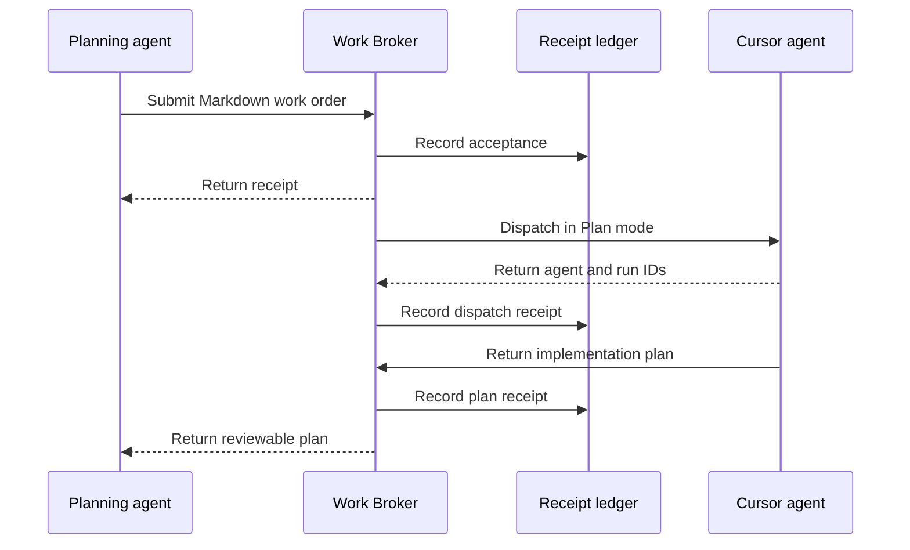
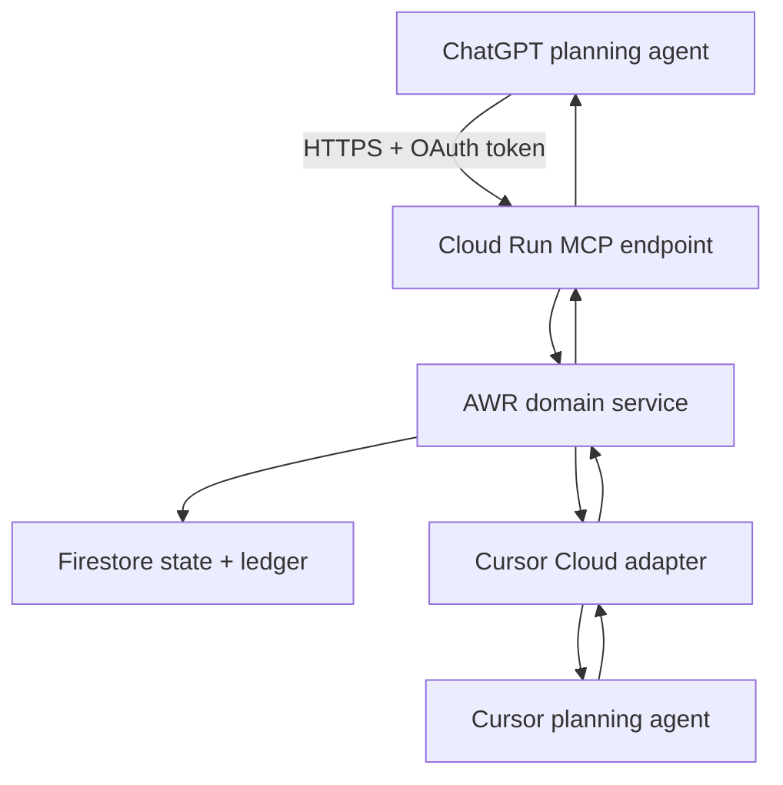

# Agent Work Relay

> **Pass work between agents—not through humans.**

Agent Work Relay is a durable agnostic work broker that routes requests,
applies guardrails, records receipts and returns results between AI agents.

## Product summary and next build for the Cursor engineering team

**Status:** Prototype v0.1 handoff

**Date:** 2026-08-28

**Repository:** `datateamsix/agent-work-relay`

**Next milestone:** Hosted ChatGPT → AWR → Cursor prompt-to-plan loop

## The problem: humans are the message couriers

AI-assisted engineering often starts in one tool and finishes in another.

Someone develops a feature or refinement with ChatGPT or Claude, turns the
conversation into Markdown, downloads or copies it, changes tabs, finds the
right repository session, and pastes it into Cursor or Claude Code. When the
coding agent returns a plan, question, branch, or completion summary, the human
copies that result back to the planning conversation and repeats the loop.

Brilliant AI tools, connected by a clipboard. Madness.

The inconvenience is only part of the problem. This manual shuttle makes it
easy to:

- send an outdated specification;
- lose context or attachments;
- route work to the wrong repository or agent session;
- launch duplicate work;
- lose track of approvals and refinements; or
- forget exactly what each agent sent and received.

## How the relay works

Agent Work Relay (AWR) gives AI agents a typed, auditable handoff path. The
prototype begins with planning agents and coding agents, but its contracts and
provider boundaries are intentionally broader than engineering.



AWR is not another coding agent. It is the control plane between agents. It
owns deterministic classification, routing, state, idempotency, receipts, and
the general ledger. Humans retain review and approval authority without acting
as the transport layer.

## Product principles

1. **The relay moves the work; the human makes the decisions.**
2. **Every handoff produces a receipt.**
3. **Accepted payloads are immutable and fingerprinted.**
4. **Keywords select intent but never grant execution authority.**
5. **Planning requests are read-only and fail closed.**
6. **Every external side effect is idempotent.**
7. **Storage and executor providers remain replaceable.**
8. **Current state is useful; the append-only ledger is the audit record.**

## Current implementation

The repository already implements the first complete local vertical slice,
`AWR-GT-001`.

### Accepted commands

```text
@awr feature.plan
@awr refinement.plan parent=<work-order-id>
```

The first creates a new planning work order. The second validates the parent,
inherits its repository binding, and reuses its durable Cursor agent session.

### Available MCP tools

| Tool | Purpose | Side effect |
|---|---|---|
| `submit_prompt_for_planning` | Validate, fingerprint, store, wrap, and route Markdown | Creates a work order and Cursor planning run |
| `refresh_planning` | Read Cursor run state and capture the terminal plan | Adds terminal receipts once |
| `get_plan` | Return the immutable `PlanPacket` | Read only |
| `get_work_order_timeline` | Return the ordered receipt ledger | Read only |

### Proven local flow

```text
ACCEPTED → ROUTED → PLANNING → PLAN_READY
```

The recording adapter executes the entire path without credentials. The real
Cursor Cloud adapter:

- creates agents through the Cursor Cloud Agents API v1;
- uses native `mode=plan`;
- sends `workOnCurrentBranch=false`;
- sends `autoCreatePR=false`;
- assigns a deterministic Cursor agent ID for idempotency;
- reuses the parent agent for refinements; and
- retrieves and fingerprints the terminal planning result.

The current suite passes formatting, linting, strict type checking, package
build, and 15 automated tests.

## What is not built yet

The local broker is not yet the clipboard-free ChatGPT workflow. ChatGPT needs
an authenticated HTTPS Streamable HTTP MCP endpoint with durable hosted state.

The next build must add:

1. a Streamable HTTP MCP application;
2. a Firestore implementation of `StateStore`;
3. application-layer authentication;
4. a production container and Cloud Run entry point;
5. GCP deployment configuration and operator documentation; and
6. a live proof against a real Cursor planning run.

Do not expand into code execution, Slack approvals, Claude execution,
Supabase, or a dashboard during this slice.

## Target GCP deployment

AWR will use the existing PreM3 GCP project while remaining operationally
isolated from the PreM3 application.

| Setting | Target |
|---|---|
| GCP project | `modelready-m3` |
| Project number | `912257136465` |
| Region | `us-central1` |
| Cloud Run service | `agent-work-relay` |
| MCP endpoint | `https://<cloud-run-host>/mcp` |
| Health endpoint | `https://<cloud-run-host>/healthz` |
| State store | Existing Firestore `(default)` database, Native mode |
| Executor | Cursor Cloud Agents API v1 |
| Runtime identity | `awr-runtime@modelready-m3.iam.gserviceaccount.com` |
| Cursor secret | `awr-cursor-api-key` |
| MCP authentication | OAuth 2.1 resource server with configurable issuer |

### Isolation from PreM3

- Do not deploy AWR as part of the PreM3 Cloud Run service.
- Do not reuse `m3-runtime` as the AWR runtime identity.
- Do not grant AWR access to PreM3 BigQuery datasets or storage buckets.
- Use dedicated Firestore collection names beginning with `awr_`.
- Use dedicated Secret Manager secrets and auth configuration.
- Keep AWR logs, service configuration, and deployment scripts independently
  identifiable.

The AWR service needs a public network route because ChatGPT must reach it.
Public reachability does **not** mean an unauthenticated application. Cloud Run
may permit the network invocation while AWR rejects every `/mcp` request that
lacks a valid OAuth access token. `/healthz` may remain public and must not
expose configuration or dependency details.

## Hosted architecture



Keep MCP, HTTP, Firestore, authentication, and Cursor as adapters around the
existing domain service. Do not move validation or state-transition policy into
FastAPI routes, MCP tools, or the Firestore repository.

## Firestore design requirements

The Firestore adapter must satisfy the same `StateStore` contract and
conformance behavior as SQLite.

Recommended prototype collections:

```text
awr_work_orders/{work_order_id}
awr_work_orders/{work_order_id}/ledger/{sequence_event_id}
awr_idempotency/{idempotency_key_hash}
```

The work-order document is a materialized snapshot. Ledger documents are
append-only. Store the current ledger sequence on the work order and allocate
the next sequence inside a Firestore transaction.

Required guarantees:

- atomic work-order creation and initial ledger receipt;
- unique idempotency-key claim;
- compare-and-set version/status transitions;
- atomic state transition and corresponding ledger append;
- ordered ledger reads;
- no mutation or deletion of existing ledger entries;
- replay returns the original result without launching another Cursor run; and
- terminal plan capture emits `plan.received` and `plan.available` once.

The prototype may store Markdown in Firestore, but it must reject inputs above
512 KiB so payload and indexes remain safely below Firestore's document limit.
Do not index raw Markdown, wrapped Markdown, plan text, hashes, or nested ledger
payload bodies unless a query requires it.

## Authentication requirements

An authenticated ChatGPT MCP connector is expected to use an OAuth 2.1 flow
that conforms to the MCP authorization specification. ChatGPT cannot present a
custom API key for this purpose. The deployed AWR service must therefore act as
an OAuth resource server; a static development token may exist only for local
tests and must be impossible to enable in the production configuration.

The next build must:

- publish RFC 9728 protected-resource metadata at
  `/.well-known/oauth-protected-resource`;
- return a `401` challenge containing `WWW-Authenticate` metadata when an
  access token is missing or invalid;
- declare an OAuth security scheme and required scopes on every MCP tool;
- validate signature, issuer, AWR audience/resource, expiration, and scopes on
  every request;
- support ChatGPT's authorization-code flow with PKCE `S256` through a
  standards-compliant authorization server;
- support a predefined OAuth client, CIMD, or dynamic client registration as
  selected during planning;
- use narrow prototype scopes such as `awr:plan`, `awr:read`, and
  `awr:refresh`;
- never log authorization headers, tokens, claims beyond safe actor IDs, the
  Cursor key, or raw secret values;
- protect `/mcp` and every state-bearing REST endpoint; and
- keep `/healthz` minimal and public.

Keep the resource-server implementation provider-neutral. Before coding,
evaluate whether the existing PreM3 Clerk setup satisfies ChatGPT's current
MCP requirements: discovery metadata, PKCE `S256`, one of the supported client
registration approaches, resource/audience propagation, and usable access
tokens. If it does, use it through configuration without importing PreM3
application code. If it does not, recommend a compatible managed authorization
server in the plan. Do not invent or casually self-host a new identity provider
inside AWR.

## Runtime and deployment requirements

- Python 3.12.
- One ASGI application exposing Streamable HTTP MCP at `/mcp` and health at
  `/healthz`.
- Stateless MCP transport suitable for multiple Cloud Run instances.
- Listen on the Cloud Run `PORT` environment variable.
- Add `Dockerfile` and `.dockerignore`.
- Run as a non-root container user.
- Pin production dependencies through the existing `pyproject.toml` and lock
  file.
- Use structured logs containing correlation IDs, work-order IDs, event types,
  external agent/run IDs, duration, and result status.
- Never log raw prompts, plan bodies, authorization headers, or secrets.
- Set conservative initial capacity: 1 CPU, 512 MiB memory, concurrency 20,
  minimum instances 0, maximum instances 2.
- Keep request handlers non-blocking where practical. A user-triggered
  `refresh_planning` call is sufficient for this milestone; Cloud Tasks polling
  is a later reliability improvement.

### Minimum runtime permissions

Grant `awr-runtime` only:

- Firestore/Datastore user access needed for the AWR collections;
- Secret Manager accessor on `awr-cursor-api-key` and any auth-provider secret
  explicitly required by the approved OAuth design; and
- normal Cloud Run logging permissions.

Do not grant Vertex AI, BigQuery, or Cloud Storage roles merely because the
service shares the PreM3 project.

## Required deliverables

The next pull request should contain:

- `FirestoreStateStore` behind the existing storage port;
- shared SQLite/Firestore conformance tests;
- Streamable HTTP MCP ASGI application;
- OAuth protected-resource metadata, token verification, scope enforcement,
  and tests;
- `/healthz` endpoint;
- production `Dockerfile` and `.dockerignore`;
- GCP deployment script or reproducible command file;
- Firestore index-exemption documentation or configuration;
- environment-variable and Secret Manager documentation;
- a Cloud Run smoke-test script;
- an updated live runbook; and
- a completion packet with deployment evidence and the full receipt timeline.

## Acceptance criteria

The build is complete only when all of the following are true:

1. Local tests pass for SQLite and the Firestore emulator or a deterministic
   Firestore test double.
2. The container starts locally and `/healthz` returns `200`.
3. `/mcp` rejects missing, invalid, expired, wrong-issuer, wrong-audience, and
   insufficient-scope tokens with the correct OAuth challenge.
4. An authenticated MCP client discovers exactly the four prototype tools.
5. The service deploys to `modelready-m3` in `us-central1` under
   `awr-runtime`.
6. No Cursor or MCP secret appears in Git, Cloud Run configuration output,
   application logs, Firestore, receipts, or exception bodies.
7. ChatGPT completes OAuth linking and submits `examples/AWR-GT-001.md`
   without manual file transfer.
8. AWR returns an acceptance receipt containing the work-order ID and content
   fingerprint.
9. Cursor accepts one and only one Plan-mode run against the configured
   repository.
10. Cursor does not edit files, create a branch, push, or open a pull request.
11. ChatGPT calls `refresh_planning` and receives a fingerprinted terminal
    `PlanPacket`.
12. `get_work_order_timeline` returns, in order:

    ```text
    work_order.accepted
    work_order.routed
    executor.acknowledged
    plan.received
    plan.available
    ```

13. Replaying the same idempotency key returns the original work order and does
    not create another Cursor agent or run.
14. The existing recording demo, Cursor adapter tests, lint, formatting, mypy,
    and package build remain green.

## Explicit non-goals

- No `plan.execute` or code-writing authority.
- No Slack approval workflow.
- No Claude executor.
- No Supabase implementation in this pull request.
- No dashboard.
- No generic multi-tenancy system.
- No asynchronous Cloud Tasks polling yet.
- No changes to the PreM3 runtime, data plane, IAM bindings, or deployment.

## Build prompt for Cursor

Copy the prompt below into a new Cursor Cloud agent for this repository. Start
in planning mode, review the plan, and only then authorize implementation.

```text
Implement the next Agent Work Relay milestone: an authenticated,
Firestore-backed remote MCP server deployed to Google Cloud Run.

Repository:
https://github.com/datateamsix/agent-work-relay

Read before planning:
- AGENTS.md
- README.md
- docs/ARCHITECTURE.md
- docs/AWR-GT-001.md
- docs/LIVE_PROTOTYPE.md
- docs/CURSOR_PRODUCT_SUMMARY_AND_CLOUD_RUN_BUILD.md

GCP target:
- project: modelready-m3
- project number: 912257136465
- region: us-central1
- Cloud Run service: agent-work-relay
- runtime service account:
  awr-runtime@modelready-m3.iam.gserviceaccount.com
- Firestore: existing (default) Native-mode database
- Cursor secret: awr-cursor-api-key
- MCP authentication: OAuth 2.1 resource server with configurable issuer

First produce a repository-aware implementation plan. Identify the exact MCP
Python SDK Streamable HTTP/ASGI mechanism supported by the locked dependency
version; do not invent an API. Check the current official ChatGPT MCP
authentication requirements. Evaluate whether the existing PreM3 Clerk setup
can serve as the authorization server without coupling AWR to PreM3 code. If it
cannot, recommend a compatible managed OAuth provider and explain the smallest
operator setup required. Describe the Firestore transaction model, OAuth
resource-server boundary, container entry point, GCP resources, IAM roles,
tests, live proof, and every file you expect to change. Treat authorization
server selection as a blocking plan decision; raise other questions only when
genuinely blocking.

After plan approval, implement the smallest complete hosted vertical slice:

1. Add FirestoreStateStore behind the existing StateStore port. Preserve the
   domain contracts and make Firestore pass the shared storage conformance
   suite. Use transactions for idempotency claims, state transitions, ledger
   sequence allocation, and terminal-plan capture.
2. Add a stateless HTTPS Streamable HTTP MCP ASGI application at /mcp and a
   minimal /healthz endpoint. Preserve the four existing MCP tools and their
   input/output contracts.
3. Add OAuth 2.1 resource-server support conforming to the current MCP
   authorization specification. Publish protected-resource metadata; return
   correct WWW-Authenticate challenges; declare tool security schemes; and
   verify token signature, issuer, audience/resource, expiration, and scopes.
   Keep the issuer configurable. A static token mode may be used only in local
   tests and must fail closed in the deployed production profile.
4. Add production container and Cloud Run configuration. Use Python 3.12,
   listen on PORT, run as non-root, and keep AWR isolated from PreM3 resources.
5. Add a reproducible GCP setup/deploy script. Create or bind the dedicated
   awr-runtime identity, dedicated secrets, and least-privilege IAM. Do not
   grant Vertex AI, BigQuery, or Cloud Storage access.
6. Add structured, redacted operational logging and a smoke-test script.
7. Update README and docs/LIVE_PROTOTYPE.md with exact local, deployment, MCP
   connection, rollback, and AWR-GT-001 proof instructions.

Safety and scope rules:
- Accepted work-order payloads are immutable.
- Every transition and external handoff creates an append-only ledger event.
- All executor side effects are idempotent.
- Decorators select intent but never grant authority.
- feature.plan and refinement.plan remain strictly plan-only.
- Do not implement execution mode, Slack, Claude, Supabase, a dashboard, or
  Cloud Tasks in this slice.
- Do not change or deploy the PreM3 service.
- Do not expose an unauthenticated MCP endpoint or treat a custom API key as
  ChatGPT authentication.
- Do not commit or print secret values.

Before completion, run formatting, linting, mypy, the full test suite, package
build, container smoke tests, OAuth metadata and token-validation tests,
Firestore conformance tests, and the recording golden test. If GCP credentials
and an approved OAuth provider are available, deploy to the specified project
and run the live plan-only proof. If either is unavailable, stop at a
deploy-ready state and state exactly which operator configuration or
human-authenticated command remains.

Return a completion packet containing:
- branch and commit SHA;
- files changed;
- architecture and security decisions;
- tests and exact results;
- deployed Cloud Run service URL and revision, if deployed;
- Secret Manager and IAM resource names without secret values;
- live AWR work-order, Cursor agent, and Cursor run IDs;
- ordered ledger timeline;
- known limitations and next recommended slice.
```

## Recommended execution sequence

1. Send the build prompt to Cursor in Plan mode.
2. Review the proposed Firestore and auth design.
3. Approve implementation on a feature branch.
4. Let Cursor implement and test without deploying first.
5. Review the diff and security-sensitive configuration.
6. Configure the approved OAuth authorization server and ChatGPT client.
7. Authenticate `gcloud` as the project owner and authorize the deployment.
8. Add secret values directly through Secret Manager; never send them through
   the agent conversation.
9. Connect ChatGPT and run the live AWR golden test against this repository in
   Plan mode.
10. Return the completion packet for review before enabling another repository.

## Reference documentation

- [OpenAI remote MCP guide](https://developers.openai.com/api/docs/guides/tools-connectors-mcp)
- [ChatGPT MCP authentication](https://developers.openai.com/plugins/build/auth)
- [Cursor Cloud Agents API](https://cursor.com/docs/cloud-agent/api/endpoints)
- [Google Cloud Run documentation](https://cloud.google.com/run/docs)
- [Google Cloud Firestore transactions](https://cloud.google.com/firestore/docs/manage-data/transactions)
- [Google Secret Manager with Cloud Run](https://cloud.google.com/run/docs/configuring/services/secrets)
